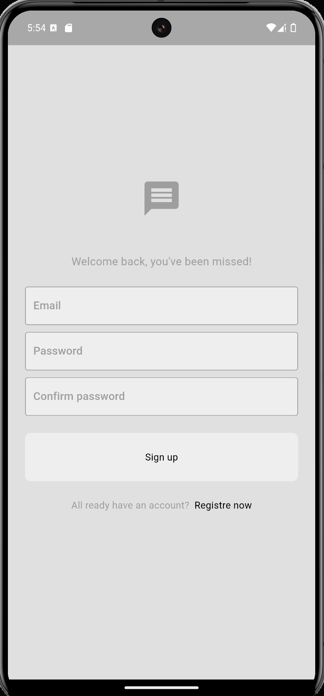
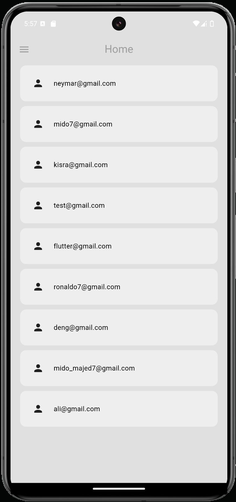
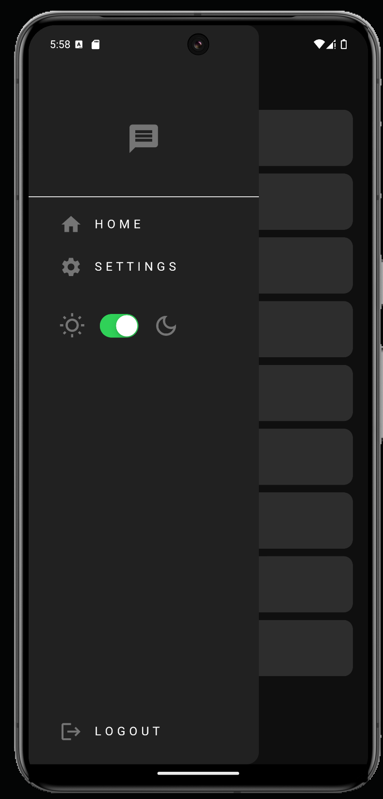
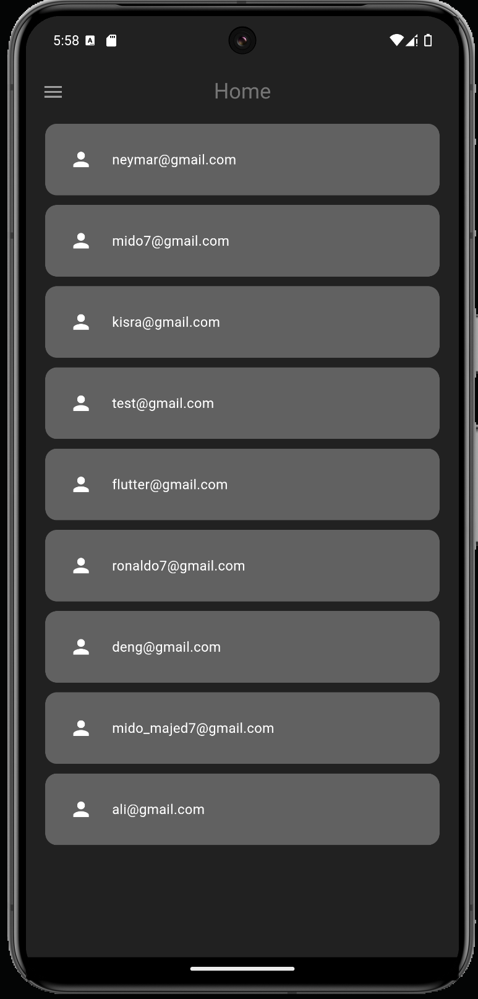
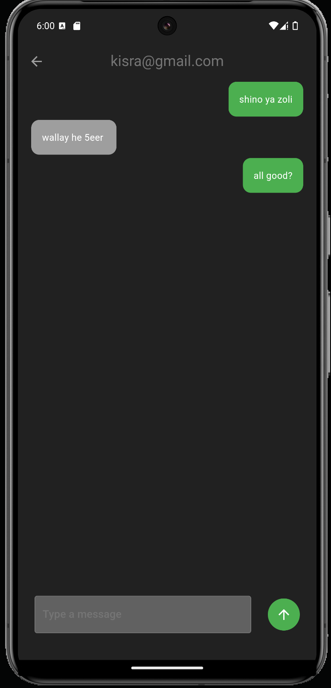

# FireBase Chat App 💬
This chat app is a real-time messaging application developed using Flutter and powered by Firebase. It provides users with a seamless messaging experience, featuring real-time messaging, secure authentication, push notifications, and the ability to change themes. With a modern user interface and robust backend capabilities, this chat app is designed for individuals who need a reliable and secure communication platform.

The app includes features like Firebase Authentication for secure login, real-time message syncing, push notifications to keep users updated on new messages, and theme customization to personalize the user experience. Whether for personal or professional use, this chat app offers an intuitive and feature-rich chat experience.

## Installation

clone project from repo and run using command.

```bash
flutter run
```

## Screenshots
|  | |
|--------------|----------------|
|  |  |
 | |
  |

## Contact
For any questions or collaboration opportunities, feel free to reach out:
- **Email**: mohmad0atif@gmail.com

## Contributing
Pull requests are welcomed.
